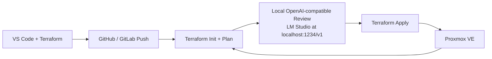

# IaaC Homelab Terraform Scaffold

This repository is a modular Terraform scaffold for a Proxmox VE homelab with an AI review gate. The current implementation focuses on Proxmox VMs and LXC containers through the `bpg/proxmox` provider, while keeping the input model extensible enough to add cloud modules such as AWS later without changing the top-level variable shape.

## Directory Layout

```text
.
├─ .github/
│  └─ workflows/
│     └─ terraform.yml
├─ .vscode/
│  ├─ extensions.json
│  └─ settings.json
├─ environments/
│  └─ homelab/
│     ├─ backend.tf
│     ├─ ci.tfvars
│     ├─ locals.tf
│     ├─ main.tf
│     ├─ outputs.tf
│     ├─ provider.tf
│     ├─ terraform.tfvars.example
│     ├─ variables.tf
│     └─ versions.tf
├─ modules/
│  ├─ proxmox_lxc/
│  │  ├─ main.tf
│  │  ├─ outputs.tf
│  │  └─ variables.tf
│  ├─ proxmox_vm/
│  │  ├─ main.tf
│  │  ├─ outputs.tf
│  │  └─ variables.tf
│  ├─ proxmox_vm_legacy/
│  │  ├─ main.tf
│  │  ├─ outputs.tf
│  │  └─ variables.tf
│  └─ aws_ec2/
│     └─ README.md
├─ scripts/
│  ├─ ai_plan_review.py
│  ├─ load-homelab-env.ps1
│  ├─ terraform-init.ps1
│  ├─ terraform-plan.ps1
│  ├─ terraform-apply.ps1
│  ├─ terraform-destroy.ps1
│  ├─ terraform-destroy-target.ps1
│  └─ terraform-retest.ps1
├─ .gitignore
└─ README.md
```

## Architecture



The design is intentionally self-healing in the Terraform sense: every pipeline run recomputes the desired state and compares it with the live Proxmox environment. If someone changes a VM or container in the Proxmox UI, the next `terraform plan` will surface the drift and the next approved apply will converge the environment back to code.

## What Is Included

This scaffold includes:

- A dedicated Proxmox VM module using `proxmox_virtual_environment_vm`.
- A legacy Proxmox VM module variant for import-friendly lifecycle behavior.
- A dedicated Proxmox LXC module using `proxmox_virtual_environment_container`.
- A normalized, future-facing `compute_nodes` input structure that can carry Proxmox-specific and future AWS-specific payloads.
- A GitHub Actions workflow that runs `terraform init`, `terraform plan`, `terraform show -json`, and a local AI gate before apply.
- VS Code settings that format Terraform/HCL on save.

## CI Import Bootstrap (Verified)

The workflow now bootstraps state in CI by importing existing Proxmox workloads before planning. This was verified end-to-end on run `27479246842`.

Key behavior:

- Plan and apply jobs import `edge_vm` and `ci_runner` first, then run `terraform plan`.
- Imports use Proxmox ID format `node/vmid` (example: `h1/1101`).
- Windows PowerShell address escaping is handled by routing Terraform import/plan through `cmd /c`.
- The plan job removes stale local state files on the runner before `terraform init` so each run starts clean.
- Module lifecycle `ignore_changes` suppresses provider-populated defaults after import so CI plans stay stable.

Required Proxmox token permissions for CI imports:

- `PVEVMAdmin` at `/` (propagated)
- `PVEDatastoreAdmin` at `/storage/local` and `/storage/local-lvm`

Workflow inputs are sourced from tracked [environments/homelab/ci.tfvars](environments/homelab/ci.tfvars), while secrets remain in GitHub Actions (`PROXMOX_API_TOKEN`).

## Important Implementation Notes

The AI review step posts the full Terraform plan JSON to a local OpenAI-compatible endpoint, such as LM Studio, using `http://localhost:1234/v1/chat/completions`. Because that endpoint is local, the CI runner must be self-hosted on the same machine or on a machine that can reach the local service. A hosted runner cannot call your workstation's `localhost`.

For durable drift detection across workflow runs, use a persistent Terraform backend. The repo keeps a local backend for easy local validation, and also includes a remote backend example for S3-compatible storage such as MinIO in [environments/homelab/backend.hcl.example](environments/homelab/backend.hcl.example).

## VS Code Setup

Install the recommended extensions:

- `hashicorp.terraform`
- `GitHub.copilot`
- `GitHub.copilot-chat`

The workspace settings enable format-on-save and bind Terraform/HCL files to the HashiCorp formatter.

## Usage

1. Copy `environments/homelab/terraform.tfvars.example` to `environments/homelab/terraform.tfvars`.
2. Populate the Proxmox endpoint and non-secret settings.
3. Copy `environments/homelab/.env.example` to `environments/homelab/.env` and place your Proxmox token there.
4. Set VM clone/template IDs in `compute_nodes` to valid templates in your Proxmox environment.
5. Run Terraform from the homelab environment directory:

```bash
terraform -chdir=environments/homelab init
terraform -chdir=environments/homelab plan
```

For local automation, the helper scripts automatically load `environments/homelab/.env` if it exists. Store secrets there rather than in `terraform.tfvars`.

The env loader now validates token format and fails fast on placeholder values. Accepted format is `user@realm!tokenid=secret`.

If you want the remote-state path, copy [environments/homelab/backend.hcl.example](environments/homelab/backend.hcl.example) to `backend.hcl`, fill in your bucket and endpoint, then use the helper scripts:

```powershell
scripts/terraform-init.ps1
scripts/terraform-plan.ps1
scripts/terraform-apply.ps1
```

The scripts are fail-fast wrappers around init/plan/apply/destroy flows and stop immediately on Terraform errors.

For cleanup and repeatability testing without using the Proxmox GUI, use:

```powershell
scripts/terraform-destroy.ps1 -AutoApprove
scripts/terraform-plan.ps1
scripts/terraform-apply.ps1
terraform -chdir=environments/homelab plan -input=false
```

Or run the end-to-end local retest wrapper:

```powershell
scripts/terraform-retest.ps1
```

This performs init, destroy, plan, apply, and a final drift-check plan.

In the current homelab config, `edge_vm` is cloned from template VM `889`.

For partial reset of a single workload by name (VM or LXC), use:

```powershell
scripts/terraform-destroy-target.ps1 -WorkloadName edge_vm -AutoApprove
scripts/terraform-plan.ps1
scripts/terraform-apply.ps1
```

The target helper resolves the exact resource address from Terraform state, including strict/legacy VM module routing.

The apply workflow also runs a post-provision health check using Terraform outputs plus the Proxmox API. It fails if a managed VM or LXC is not present in cluster resources or is not in the `running` state.

If you also want Terraform to report VM guest IPs through the QEMU guest agent, the Proxmox token needs guest-agent read permissions such as `VM.GuestAgent.Audit`.

## Pipeline Flow

1. A commit lands on `main` or a pull request opens.
2. The workflow checks out the repository and runs Terraform format, init, validate, and plan.
3. Terraform exports JSON plan output.
4. The JSON is sent to the local AI endpoint for security, drift, and structural review.
5. If the review passes, a manual workflow dispatch can proceed to `terraform apply` using the saved plan artifact.

For import-bootstrap runs, step 2 includes explicit import of known existing resources before planning.

## Future AWS Integration

The top-level `compute_nodes` shape already distinguishes the provider (`platform`) from the workload type (`kind`) and reserves a provider-specific payload block. A future AWS module can consume the same pattern without reshaping the rest of the repository.

## Security Gate Behavior

The AI review script is intentionally fail-closed. If the local endpoint is unavailable, returns malformed JSON, or marks the plan as unsafe, the pipeline stops before apply.

## Token Rotation

When rotating Proxmox API credentials, update both local and CI paths in one pass:

1. Create a new Proxmox API token with least-privilege permissions for your Terraform scope.
2. Update `environments/homelab/.env` with `TF_VAR_proxmox_api_token` and/or `PROXMOX_VE_API_TOKEN` using the new value.
3. Update the GitHub Actions secret `PROXMOX_API_TOKEN`.
4. Re-run local validation:

```powershell
. scripts/load-homelab-env.ps1
terraform -chdir=environments/homelab validate
terraform -chdir=environments/homelab plan -input=false
```

5. Decommission the old token after successful local and CI plan runs.
